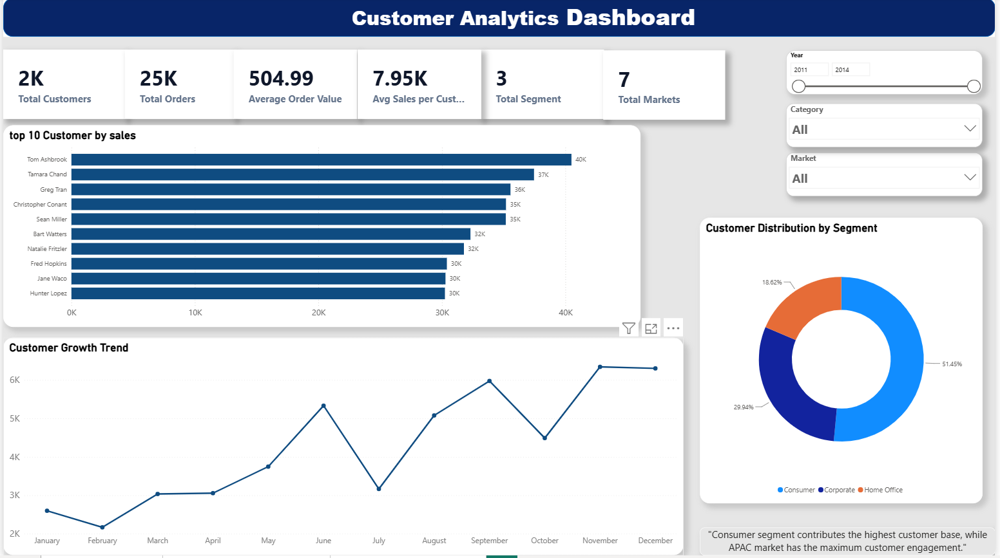
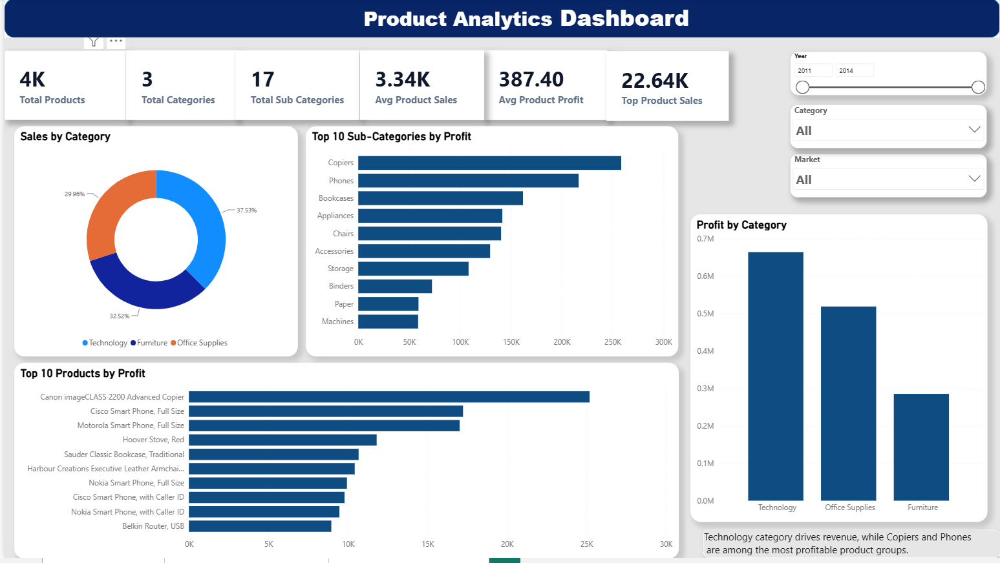

# 📊 Global Superstore Business Intelligence Dashboard

## 🚀 Project Overview

This project is a comprehensive Power BI Business Intelligence solution developed using the Global Superstore dataset. The dashboard transforms raw retail data into meaningful insights through interactive visualizations, KPI tracking, and analytical reports.

The objective of this project is to help business stakeholders monitor sales performance, analyze customer behavior, and identify profitable products for data-driven decision making.

---

## 📌 Dashboard Pages

### 1️⃣ Executive Overview Dashboard

Provides a high-level business summary including:

* Total Sales
* Total Profit
* Profit Margin
* Sales Trend Analysis
* Market-wise Sales Distribution
* Product Performance Analysis
* Geographic Sales Insights

### 2️⃣ Customer Analytics Dashboard

Focuses on customer behavior and engagement:

* Total Customers Analysis
* Customer Segmentation
* Customer Growth Trends
* Top Customers by Sales
* Market-wise Customer Distribution
* Customer Insights

### 3️⃣ Product Analytics Dashboard

Provides detailed product performance analysis:

* Category-wise Sales Distribution
* Product Profitability Analysis
* Sub-Category Performance
* Top Products by Profit
* Product Insights

---

## 🛠️ Tools & Technologies

* Power BI
* DAX (Data Analysis Expressions)
* Power Query
* Data Modeling
* Data Visualization
* Business Intelligence Reporting

---

## 📈 Key Features

✔ Interactive KPI Cards
✔ Dynamic Filters & Slicers
✔ Data Modeling & Relationships
✔ Sales & Profit Analysis
✔ Customer Analytics
✔ Product Performance Insights
✔ Professional Dashboard Design

---

## 🎯 Skills Demonstrated

* Data Cleaning & Transformation
* Dashboard Development
* KPI Design
* Data Modeling
* Business Intelligence
* Data Visualization
* Analytical Thinking

---

## 📷 Dashboard Preview

### Executive Overview

### Customer Analytics

### Product Analytics

---

## 👩‍💻 Developed By

**Harshita Chadhokar**

B.Tech Computer Science Engineering
Aspiring Data Analyst | Power BI | SQL | Python | Data Visualization
